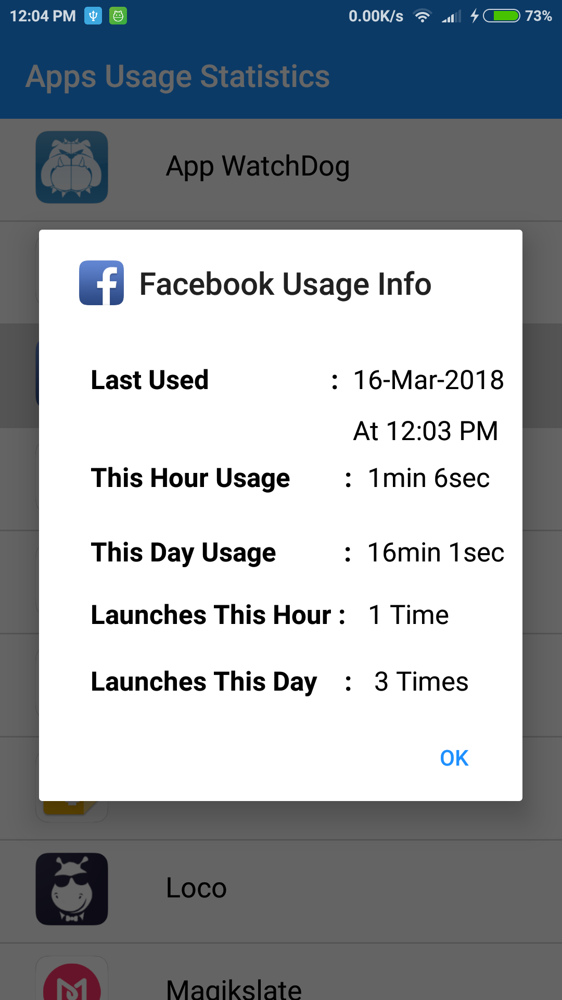
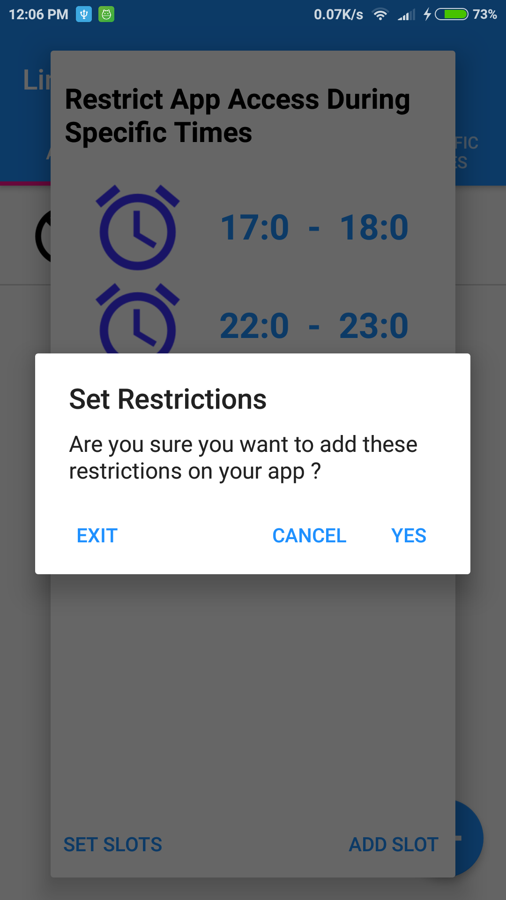
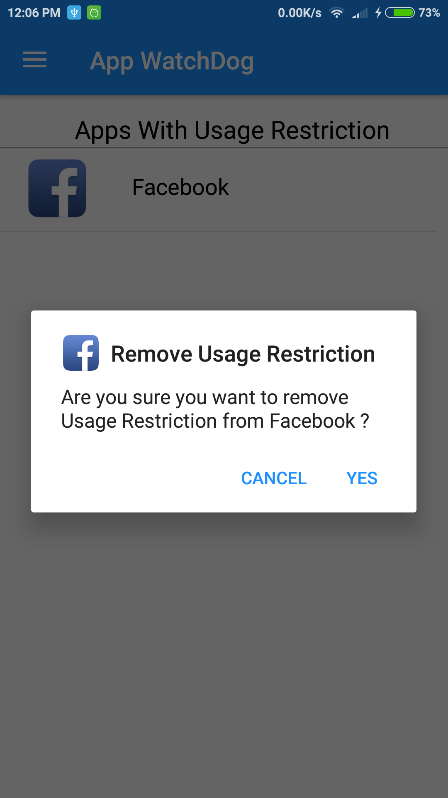
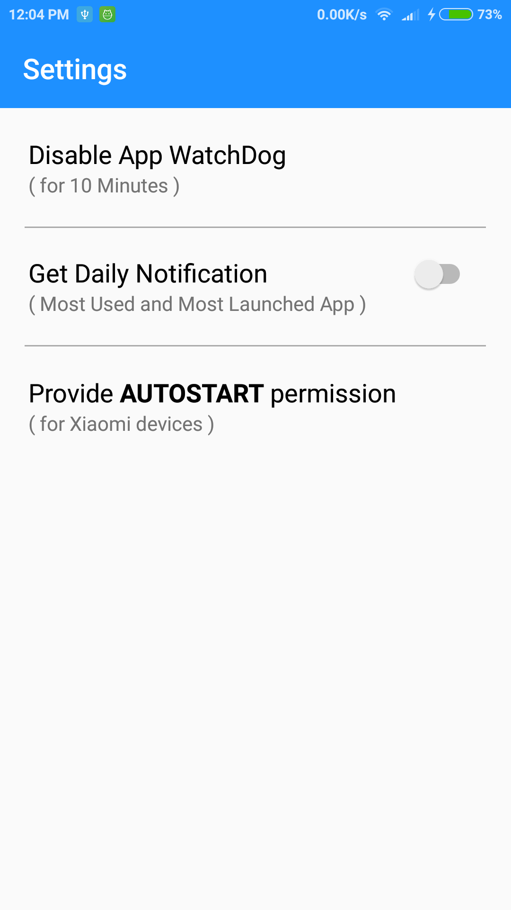

# App-WatchDog-Android-App
App WatchDog is an android app built natively in Java using Android Studio. This app tracks the usage statistics of all installed apps (except system apps) and usage restriction can also be set on any app to control its usage.

The app is currently not available on the Play Store.
Here is the Google Drive Download Link : [Download App WatchDog](https://drive.google.com/open?id=1W-GfTuOBQbFKBL7zMrNbC6z6oe4HE9Ql)

## Getting Started

 Open the terminal:
 ```
 $ cd \<required-path>
 $ git clone https://github.com/aakashbansal/App-WatchDog-Android-App.git
 ```

After that open the directory from Android Studio. Go to Run -> Run app to launch the app into emulator or device.

**Known Issues While Setting Up The Project**

Some users may face a known issue with Android Studio while setting-up this project that says something along the lines of : 

```
Unsupported Modules Detected : Compilation is not supported for following modules: 
App-WatchDog-Android-App, app.
Unfortunately you can't have non-Gradle Java modules and Android-Gradle modules in one project.
```

To overcome this issue, go to **File -> Invalidate Caches/Restart...**. Select **Invalidate and Restart** from the on-screen prompt. Android Studio will restart now.

Allow the project to build afresh. This may take some time (a lot actually, depending on the CPU). Let it finish. Ignore any intermediate errors such as **Error Loading Project: Cannot load 2 modules**.

After this step, the project should be up and running.

If the error still persists, open the **build.gradle** file . Add some random white spaces in it. This will give a **Sync Now** option on-screen. Click on that and allow the project to sync. The App should finally be working now.

**Enjoy :)**


## Overview

The app performs **two** major tasks :

### Usage Stats Tracker
It works as a tracker that tracks the app usage activity of a user by telling the following info about any given installed app(not system apps) :
* When was the app **Last Used**?
* How much time has the app spent in foreground in the **Current Hour** ?
* How much time has the app spent in foreground  on the **Current Day** ?
* How many times was the app launched in the **Current Hour** ?
* How many times was the app launched on the **Current Day** ?


### Usage Limit Controller

The app can also serve as **WatchDog** that checks to see if the user has exceeded the **Usage Limit Quota** on any app that he himself has set up. If the usage limit is exceeded, the concerned app exits(on which limit is set up).

Following type of restrictions can be set up on an app:
* Restriction on number of **Launches** allowed ( Per Hour / Per Day ).
* Restriction on  **Usage Time** allowed ( Per Hour / Per Day ).
* Restriction during **Specific Time Intervals** (App Access Not Allowed during specified Time Intervals).


## App WatchDog Demo

**App Screenshots for viewing Usage Stats**

  

**App Screenshots for Setting Usage Limit**

      

**View Added Restriction Info**

 

**Remove Restriction**



**Settings**



## Project Structure


 **Java Files**
 
 
* **activity** - contain classes corresponding to different activities.

* **adapter** - contain list view adapters.

* **database** - contain classes for manipulating the local SQLite Database. This is further sub-divided into two folders : 
  * **dbAddUsageLimit**  - for manipulating db that contains info about **Restriction Limits** set-up on apps.
  * **dbViewUsageStats** - for manipulating db that contains info about **Usage Statistics** of all installed apps.

* **DialogController** - manages the on-screen dialogs.

* **fragments** - contain classes for displaying fragments. This is further sub-divided into two folders :            
  * **AddUsageLimitDialogFragments**    - contain fragments for **Adding Usage Limit** on app.
  * **AppsWithUsageLimitInfoFragments** - contain fragments for **Viewing Usage Limit Info** of restricted apps.

* **helper** - contain various classes each with a different set of functions responsible for handling the different business logic of the app codebase. Each type of functions role is abstracted into different java class.

* **model** - contain classes responsible for modelling the data into an entity.

* **receiver** - contain various broadcast receivers, each responsible for a different role like **device turned on** , **service stopped**, **sending notification**,etc.

* **service** - contain the Android services that run in background.

* **sharedPreferences** - just a wrapper over native Android SharedPreferences API.

* **ToastController** - just a wrapper over native Android ToastController with separate class containing all the Toast Messages.


**XML Resource Files**

All XML resource files exist in **res->layouts** directory in the code structure.
Further, different views of the app are all structured into different logical directories.
```
To take advantage of the restructured code format of XML files, 
the project should be opened in "Project" view and not the "Android" view. This setting exists in 3rd or 4th row 
from upper left corner of Android Studio Screen.
```
For more info on how to open the Android Project in **Project** View,  [see this](https://stackoverflow.com/questions/33817556/android-studio-android-project-view-is-missing)

## Working

At its core, the app has two services that constantly run in background :

* **AppLaunchDetectService** - This service finds the current running app in foreground and checks to see if it has exceeded its **Usage Limit Quota**. If yes, the app exits. If no, app continues to run.
* **UsageStatsUpdateService** - This service , as the name suggests, updates the **Usage Stats** (Last Used Time, No of Launches, Time In foreground ) of the given app.

These two services perform the core tasks of the whole app. Everything major that is happening in the app is being constantly performed by these services in one way or the another using various helper functions defined in /**helper** directory.

**How does the App ensure that the services continue to run in background even after the app is removed from memory ?**

There are two **broadcast receivers** in place, one for each service; that restarts each one of them respectively when they are terminated by the User or Android OS.


## Android Permissions Required

The app requires the **USAGE STATS PERMISSION** to work. Without it, nothing in the app is going to work.

```
In some devices (such as Xiaomi), "AUTOSTART" permission will also
be required to ensure smooth functioning of the app.
```


## Contributing

The goal of this project was to learn basic Android but it grew complex with time.
If you need any help or support to understand any part of the code,please let me know.
Any improvements, bug fixes, bug reporting, new features or suggestions are definitely welcome. Those looking to contribute to this code base can also do so via Pull Requests. Any contribution is more than welcome and well appreciated. :)

## Contact Info

Email Id : aakashbansals23@gmail.com

## License

Licensed under the GNU GENERAL PUBLIC LICENSE Version 3, 29 June 2007 : https://www.gnu.org/licenses/gpl-3.0.en.html

 Copyright (C) 2007 Free Software Foundation, Inc. <http://fsf.org/>
 

